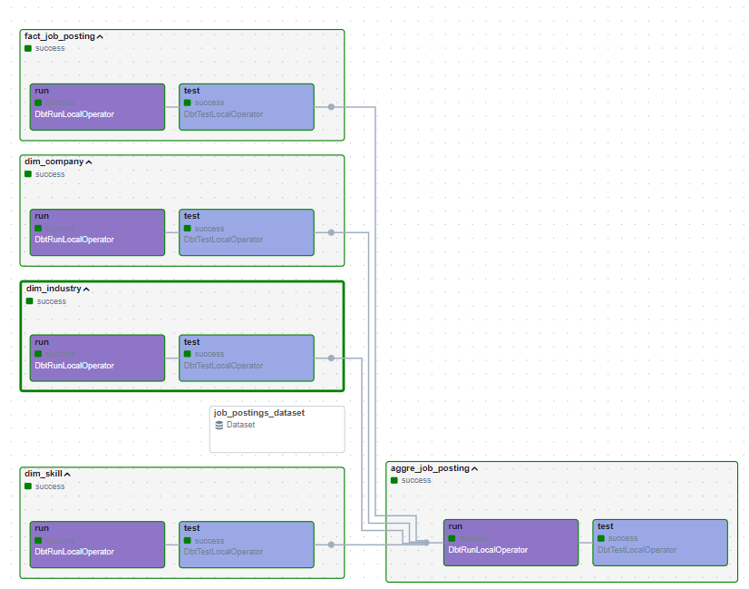
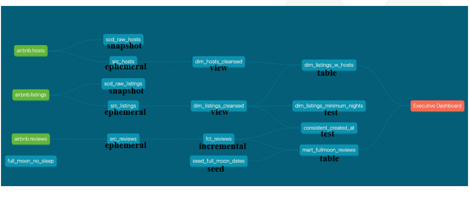
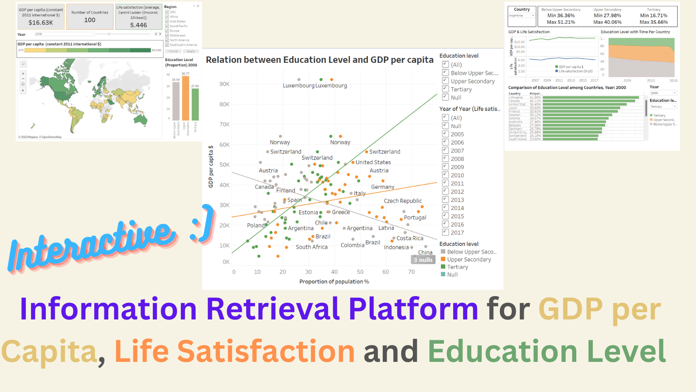

# Analytics Engineer Portfolio
The subdivision about analytics engineering, it covers dbt with high-level features and involves the usage of BI tools.

Some projects are part of projects in my [data science projects portfolio](https://github.com/xiangivyli/data-science-portfolio/blob/main/README.md). Some links show the material I created when I followed online courses.

It mainly involves 2 parts, dbt and BI reports. I hope it shows my passion for analytics engineering, I enjoy scaling data transformation in strategy.
# Table of Contents

## Part A dbt

### [Job Postings on Linkedin](https://github.com/xiangivyli/data-science-portfolio/tree/main/part_a_job_posting_linkedin_pipeline/airflow/dags/dbt)
Tag: My Design

Tools:
 - Data Transformation: **dbt** (Cosmos)
 - Data Orchestration: **Airflow**
 - Data Visualisation: **Power BI**
 - Data Quality Testing: **Soda** and **dbt test**
 - Data Lake: **Google Cloud Storage**
 - Data Warehouse: **BigQuery**

Summary:
This project aims to build an end-to-end data pipeline from a bigger picture. For the dbt part, I used **DbtDag** as the downstream of a data ingestion dag, and it is triggered by Dataset (which means once new data is in the big query, dbt starts to transform)

Lineage Graph:

### [Airbnb Hosts and Reviews Analysis](https://github.com/xiangivyli/the_dbt_bootcamp)
Tag: Udemy Course

Tools:
 - Data Transformation: **dbt core**
 - Data Warehouse: **Snowflake**
 - Data Visualisation: **Preset**

Summary: 
This project covers every aspect of dbt, from **models, snapshots, and tests to macros, documentation, analyses, and logging**. I practised each point when I followed along with this course. I plan to develop my own project with these techniques.

Lineage Graph:

## Part B BI tools

### [A self-service platform for GDP, Life Satisfaction and Education Level](https://xiangivyli.com/blog/an-information-retrieval-platform-for-gdp-satisfaction-education)
Tag: Take-home assignment

Tools: Tableau

Summary: 
This project shows how to put many metrics on one page, my design was to provide end-users flexibility to retrieve the information they want.

Dashboard (The interactive experience is better), so just put the published link here:
https://public.tableau.com/app/profile/xiang.li5182/viz/PersonalProjectsIvyLi/KeyEducation?publish=yesKey

Overview:

